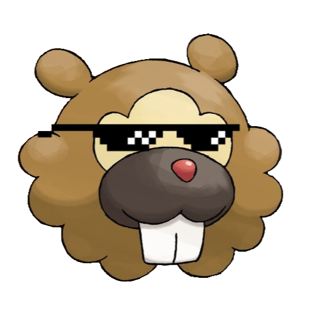

  <!-- Logo and Title -->
  
  <h1>Bidoof Meteor</h1>

  <!-- Fancy badges -->

# How to use
- Download the latest [release](/../../releases) of this mod from the releases tab.
- Put it in your `.minecraft/mods` folder where you have installed Meteor.

*Note: Meteor Client is required for this addon*

<h1>Modules:</h1>
<h2>General</h2>
<pre>
Announcer         || Announces specified actions into chat
Auto TPA          || Automatically accepts TPA requests
Chat Commands     || Chat commands
Chat Emotes       || Enables the usage of emotes in the chat
Fishy Detector    || Detects anomalies in players
Logger            || Outputs a message when certain events happen
Spam Plus         || Better than spam
</pre>
<h2>Mixins</h2>
Better Chat       || Changes to better chat
Better Tooltips   || Changes to better tooltips
GUI Theme         || Changes to GUI theme
Meteor GUI Theme  || Changes to Meteor GUI theme
<h2>HUD:</h2>
<pre>
Image HUD         || Puts an image in your HUD
Fake Position     || Fakes your coordinates
</pre>
<h1>Commands:</h1>
<pre>
Bidoof Command    || Bidoof
Name History      || Shows a players name history
</pre>
<h1>Features:</h1>
<pre>
Dark Purple Theme || Dark purple GUI theme
Recolor GUI Theme || Cool GUI theme
</pre>
